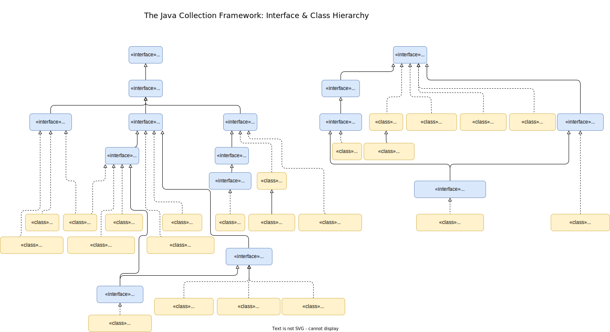

# The Java Collection Framework (JCF) - Data Structures and Algorithms in Java

<!-- TOC -->

* [The Java Collection Framework (JCF) - Data Structures and Algorithms in Java](#the-java-collection-framework-jcf---data-structures-and-algorithms-in-java)
    * [Literature and Resources](#literature-and-resources)
    * [Hierarchy of Java interfaces and classes](#hierarchy-of-java-interfaces-and-classes)
    * [Infrastructural interfaces](#infrastructural-interfaces)
        * [Iterator](#iterator)
        * [ListIterator](#listiterator)
        * [Comparable](#comparable)
        * [Comparator](#comparator)
        * [Spliterator](#spliterator)
        * [RandomAccess](#randomaccess)
    * [Collection interfaces](#collection-interfaces)
        * [Iterable](#iterable)
        * [Collection](#collection)
        * [List](#list)
        * [Queue](#queue)
            * [Implementation](#implementation)
            * [Use Cases](#use-cases)
        * [Deque](#deque)
        * [Set](#set)
            * [Common set operations](#common-set-operations)
            * [Implementations](#implementations)
            * [Performance](#performance)
        * [SortedSet](#sortedset)
        * [NavigableSet](#navigableset)
        * [BlockingQueue](#blockingqueue)
            * [Implementations](#implementations-1)
        * [BlockingDeque](#blockingdeque)
        * [TransferQueue](#transferqueue)
        * [Map](#map)
            * [Implementations (general-purpose)](#implementations-general-purpose)
            * [Performance](#performance-1)
        * [SortedMap](#sortedmap)
        * [NavigableMap](#navigablemap)
        * [Map.Entry](#mapentry)
        * [ConcurrentMap](#concurrentmap)
        * [ConcurrentNavigableMap](#concurrentnavigablemap)
        * [New collection interfaces (Java 21)](#new-collection-interfaces-java-21)
            * [SequencedCollection](#sequencedcollection)
            * [SequencedSet](#sequencedset)
            * [SequencedMap](#sequencedmap)
    * [Collection classes (implementations)](#collection-classes-implementations)
    * [General-purpose/primary implementations](#general-purposeprimary-implementations)
        * [ArrayList](#arraylist)
            * [Use Cases of ArrayList](#use-cases-of-arraylist)
        * [LinkedList](#linkedlist)
            * [Use Cases of LinkedList](#use-cases-of-linkedlist)
        * [Performance of List-based collections](#performance-of-list-based-collections)
        * [ArrayDeque](#arraydeque)
        * [HashMap](#hashmap)
            * [Hashing and hash function](#hashing-and-hash-function)
        * [IdentityHashMap](#identityhashmap)
        * [HashSet](#hashset)
        * [LinkedHashMap](#linkedhashmap)
        * [LinkedHashSet](#linkedhashset)
        * [TreeMap](#treemap)
        * [TreeSet](#treeset)
        * [EnumMap](#enummap)
        * [EnumSet](#enumset)
        * [PriorityQueue](#priorityqueue)
        * [WeakHashMap](#weakhashmap)
    * [Summary of the general-purpose collections](#summary-of-the-general-purpose-collections)
    * [Special-purpose, Thread-safe implementations](#special-purpose-thread-safe-implementations)
        * [CopyOnWriteArrayList](#copyonwritearraylist)
        * [CopyOnWriteArraySet](#copyonwritearrayset)
    * [Concurrent implementations](#concurrent-implementations)
        * [ConcurrentHashMap](#concurrenthashmap)
        * [ConcurrentLinkedQueue](#concurrentlinkedqueue)
        * [LinkedBlockingQueue](#linkedblockingqueue)
        * [ArrayBlockingQueue](#arrayblockingqueue)
        * [PriorityBlockingQueue](#priorityblockingqueue)
        * [DelayQueue](#delayqueue)
        * [SynchronousQueue](#synchronousqueue)
        * [LinkedBlockingDeque](#linkedblockingdeque)
        * [LinkedTransferQueue](#linkedtransferqueue)
        * [ConcurrentSkipListSet](#concurrentskiplistset)
        * [ConcurrentSkipListMap](#concurrentskiplistmap)
    * [Wrapper implementations](#wrapper-implementations)
        * [Collections.unmodifiable<interface> - Unmodifiable Views](#collectionsunmodifiableinterface---unmodifiable-views)
            * [Collections.unmodifiableCollection](#collectionsunmodifiablecollection)
            * [Collections.unmodifiableList](#collectionsunmodifiablelist)
            * [Collections.unmodifiableSet](#collectionsunmodifiableset)
            * [Collections.unmodifiableMap](#collectionsunmodifiablemap)
        * [<Interface>...of(...)](#interfaceof)
        * [Collections.synchronized<Interface>](#collectionssynchronizedinterface)
        * [Collections.checked<Interface>](#collectionscheckedinterface)
    * [Convenience implementations](#convenience-implementations)
        * [Arrays.asList](#arraysaslist)
        * [Collections.emptySet](#collectionsemptyset)
        * [Collections.emptyList](#collectionsemptylist)
        * [Collections.emptyMap](#collectionsemptymap)
        * [Collections.singletonList](#collectionssingletonlist)
        * [Collections.singletonMap](#collectionssingletonmap)
        * [Collections.nCopies](#collectionsncopies)
    * [Abstract implementations](#abstract-implementations)
        * [AbstractCollection](#abstractcollection)
        * [AbstractSet](#abstractset)
        * [AbstractList](#abstractlist)
        * [AbstractSequentialList](#abstractsequentiallist)
        * [AbstractQueue](#abstractqueue)
        * [AbstractMap](#abstractmap)
    * [Adapter implementations](#adapter-implementations)
        * [newSetFromMap(Map)](#newsetfrommapmap)
        * [asLifoQueue(Deque)](#aslifoqueuedeque)
    * [Legacy implementations](#legacy-implementations)
        * [Vector](#vector)
        * [Hashtable](#hashtable)
        * [Stack](#stack)
        * [Why the legacy collections should not be used?](#why-the-legacy-collections-should-not-be-used)
    * [Algorithmic methods of the Collections class](#algorithmic-methods-of-the-collections-class)
    * [Exceptions](#exceptions)
        * [UnsupportedOperationException](#unsupportedoperationexception)
        * [ConcurrentModificationException](#concurrentmodificationexception)

<!-- TOC -->

## Literature and Resources

- [Algorithms, 4/e, by KWayne, RSedgewick](https://learning.oreilly.com/library/view/algorithms-fourth-edition/9780132762564/)
- [Collections Framework Enhancements in Java SE 8](https://docs.oracle.com/javase/8/docs/technotes/guides/collections/changes8.html)
- [Collections Framework Overview](https://docs.oracle.com/javase/8/docs/technotes/guides/collections/overview.html)
- [Data Structures and Algorithms in Java, 6/e, by RTamassia, MGoodrich](https://learning.oreilly.com/library/view/data-structures-and/9781118771334/)
- [Data Structures and the Java Collections Framework, 3/e, by WJCollins](https://learning.oreilly.com/library/view/data-structures-and/9780470482674/)
- [Java Generics and Collections, by PhWadler, MNaftalin](https://learning.oreilly.com/library/view/java-generics-and/0596527756/)
- [JEP 180: Handle Frequent HashMap Collisions with Balanced Trees](http://openjdk.java.net/jeps/180)
- [Outline of the Collections Framework](https://docs.oracle.com/javase/8/docs/technotes/guides/collections/reference.html)
- [The Collections Framework](https://docs.oracle.com/javase/8/docs/technotes/guides/collections/index.html)
- [Collections Framework Overview](https://docs.oracle.com/javase/8/docs/technotes/guides/collections/overview.html)
- [Algorithms 4/e, by R. Sedgewick and K. Wayne]()
- [Grokking Algorithms: An illustrated guide for programmers and other curious people, by Bhargava A. Y]()
- [Data Structures and Algorithm Analysis in Java, 3/e, by M. Weiss]()
- [Top 10 algorithms in Interview Questions](https://www.geeksforgeeks.org/top-10-algorithms-in-interview-questions/)
- [DSA Questions & Answers](https://www.tutorialspoint.com/data_structures_algorithms/data_structures_algorithms_questions_answers.htm)
- [Top 15 Data Structures and Algorithm Interview Questions for Java Programmer - Answers](https://javarevisited.blogspot.com/2013/03/top-15-data-structures-algorithm-interview-questions-answers-java-programming.html#ixzz5IPEyun85)

## Hierarchy of Java interfaces and classes



| Domain                          | Description                                                                                                                                                                                                                                                               |
|---------------------------------|---------------------------------------------------------------------------------------------------------------------------------------------------------------------------------------------------------------------------------------------------------------------------|
| Collection interfaces           | Represent different types of collections, such as sets, lists, and mapsThese interfaces form the basis of the framework                                                                                                                                                   |
| General-purpose implementations | Primary implementations of the collection interfaces                                                                                                                                                                                                                      |
| Special-purpose implementations | Implementations designed for use in special situationsThese implementations display nonstandard performance characteristics, usage restrictions, or behavior                                                                                                              |
| Concurrent implementations      | Implementations designed for highly concurrent use                                                                                                                                                                                                                        |
| Wrapper implementations         | Add functionality, such as synchronization, to other implementations                                                                                                                                                                                                      |
| Convenience implementations     | High-performance "mini-implementations" of the collection interfaces                                                                                                                                                                                                      |
| Abstract implementations        | Partial implementations of the collection interfaces to facilitate custom implementations                                                                                                                                                                                 |
| Algorithms                      | Static methods that perform useful functions on collections, such as sorting a list                                                                                                                                                                                       |
| Infrastructure                  | Interfaces that provide essential support for the collection interfaces                                                                                                                                                                                                   |
| Array Utilities                 | Utility functions for arrays of primitive types and reference objectsNot, strictly speaking, a part of the collections framework, this feature was added to the Java platform at the same time as the collections framework and relies on some of the same infrastructure |
| Legacy implementations          | The collection classes from earlier releases, Vector and Hashtable, were retrofitted to implement the collection interfaces                                                                                                                                               |

## Infrastructural interfaces

- java.util.Iterator
- java.util.ListIterator
- java.lang.Comparable
- java.util.Comparator
- java.util.Spliterator
- java.util.RandomAccess

#### Iterator

- In addition to the functionality of the Enumeration interface, enables the user to remove elements from the backing
  collection with well-defined, useful semantics.
- Similar to the familiar Enumeration interface, but more powerful, and with improved method names.
- An iterator over a collection.
- Allow the caller to remove elements from the underlying collection during the iteration.
- An Enumeration can be converted into an Iterator by using the Enumeration#asIterator method.

| Method             | Parameter(s) | Return type | Description |
|--------------------|--------------|-------------|-------------|
| `hasNext`          |              |             |             |
| `next`             |              |             |             |
| `remove`           |              |             |             |
| `forEachRemaining` |              |             |             |

#### ListIterator

- Iterator for use with lists.
- Has the functionality of the Iterator interface
- Also supports bidirectional iteration
- Element replacement
- Element insertion, and index retrieval.

### Comparable

- Imparts a natural ordering to classes that implement it.
- The natural ordering can be used to sort a list or maintain order in a sorted set or map.
- Many classes were retrofitted to implement this interface.
- Natural ordering
- Should be consistent with overridden Object.equals() method
- Implemented in value class
- Common to declare as lambda

| Method      | Parameter(s) | Return type | Description                                            |
|-------------|--------------|-------------|--------------------------------------------------------|
| `compareTo` | T            | int         | Compares this object with the passed object for order. |

### Comparator

- Represents an order relation
- Can be used to sort a list
- Used to control the order of elements in maps and sorted sets
- Can override a type's natural ordering or order objects of a type that does not implement the Comparable interface.
- Maintain total ordering.
- Is a functional interface (able to be passed where lambda expression is required)
- Can be passed to the sort methods of Collections#sort(List,Comparator) and Arrays.#sort(Object[],Comparator)

| Method    | Parameter(s) | Return type | Description                           |
|-----------|--------------|-------------|---------------------------------------|
| `compare` | (T o1, T o2) | int         | Compares its two arguments for order. |

### Spliterator

- Allows to traverse and partition a sequence (source).
- Kind of "splittable Iterator".
- It’s a fundamental utility for Streams API.

| Method                | Parameter(s) | Return type | Description |
|-----------------------|--------------|-------------|-------------|
| `estimateSize`        |              |             |             |
| `forEachRemaining`    |              |             |             |
| `getComparator`       |              |             |             |
| `getExactSizeIfKnown` |              |             |             |
| `hasCharacteristics`  |              |             |             |
| `OfDouble`            |              |             |             |
| `OfInt`               |              |             |             |
| `OfLong`              |              |             |             |
| `OfPrimitive`         |              |             |             |
| `tryAdvance`          |              |             |             |
| `trySplit`            |              |             |             |

### RandomAccess

- Marker interface that lets List implementations indicate that they support fast (generally constant time) random
  access.
- Lets generic algorithms change their behavior to provide good performance when applied to either random or
  sequential access lists.

## Collection interfaces

| Interface                                     | Type parameter(s) | Description                                                                                                                                                                                                                 |
|-----------------------------------------------|-------------------|-----------------------------------------------------------------------------------------------------------------------------------------------------------------------------------------------------------------------------|
| `java.util.Iterable`                          | `<T>`             | Allows an object to be the target of the enhanced for statement/for-each loop.                                                                                                                                              |
| `java.util.Iterator`                          | `<E>`             | Allows to iterate over elements of a collection.                                                                                                                                                                            |
| `java.lang.Comparable`                        | `<E>`             |                                                                                                                                                                                                                             |
| `java.util.Comparator`                        | `<T>`             | A comparison function, which imposes a total ordering on  some collection of objects.                                                                                                                                       |
| `java.util.Collection`                        | `<E>`             |                                                                                                                                                                                                                             |
| `java.util.List`                              | `<E>`             | An ordered collection, where the user has precise control over where in the list each element is inserted.  The user can access elements by their integer index (position in the list), and search for elements in the list |
| `java.util.Queue`                             |                   |                                                                                                                                                                                                                             |
| `java.util.Deque`                             |                   |                                                                                                                                                                                                                             |
| `java.util.Set`                               |                   |                                                                                                                                                                                                                             |
| `java.util.SortedSet`                         |                   |                                                                                                                                                                                                                             |
| `java.util.NavigableSet`                      |                   |                                                                                                                                                                                                                             |
| `java.util.Map`                               |                   |                                                                                                                                                                                                                             |
| `java.util.SortedMap`                         |                   |                                                                                                                                                                                                                             |
| `java.util.NavigableMap`                      |                   |                                                                                                                                                                                                                             |
| `java.util.concurrent.BlockingQueue`          |                   |                                                                                                                                                                                                                             |
| `java.util.concurrent.BlockingDeque`          |                   |                                                                                                                                                                                                                             |
| `java.util.concurrent.TransferQueue`          |                   |                                                                                                                                                                                                                             |
| `java.util.concurrent.ConcurrentMap`          |                   |                                                                                                                                                                                                                             |
| `java.util.concurrent.ConcurrentNavigableMap` |                   |                                                                                                                                                                                                                             |

### Iterable

| Method        | Parameter(s)          | Return type      | Description                                 |
|---------------|-----------------------|------------------|---------------------------------------------|
| `forEach`     | `Consumer<? super T>` | `void`           | Performs the given action for each element. |
| `iterator`    | N/A                   | `Iterator<T>`    | Returns an iterator over elements           |
| `spliterator` | N/A                   | `Spliterator<T>` | Creates a `Spliterator` over the elements.  |

### Collection

| Method           | Parameter(s)            | Return type | Description                                                                                                                                     |
|------------------|-------------------------|-------------|-------------------------------------------------------------------------------------------------------------------------------------------------|
| `add`            | <E>                     | boolean     | Adds passed element E into this collection.                                                                                                     |
| `addAll`         | Collection<? extends E> | boolean     | Adds all of the elements in the specified collection to this collection.                                                                        |
| `clear`          | N/A                     | void        | Removes all of the elements from this collection.                                                                                               |
| `contains`       |                         | boolean     | Returns true if this collection contains the specified element.                                                                                 |
| `containsAll`    |                         |             |                                                                                                                                                 |
| `equals`         |                         |             |                                                                                                                                                 |
| `hashCode`       |                         |             |                                                                                                                                                 |
| `isEmpty`        | N/A                     | boolean     | Returns true if this collection contains no elements.                                                                                           |
| `iterator`       | N/A                     | Iterator<E> | Returns an iterator over the elements in this collection.                                                                                       |
| `parallelStream` |                         |             |                                                                                                                                                 |
| `remove`         | Object                  | boolean     | Removes a single instance of the specified element from this collection.                                                                        |
| `removeAll`      | Collection<?>           | boolean     | Removes all of this collection's elements that are also contained in the specified collection.                                                  |
| `removeIf`       | Predicate<? super E>    | boolean     | Removes all of the elements of this collection that satisfy the given predicate.                                                                |
| `retainAll`      | Collection<?>           | boolean     | Retains only the elements in this collection that are contained in the specified collection.                                                    |
| `size`           | N/A                     | int         | Returns the number of elements in this collection.                                                                                              |
| `spliterator`    |                         |             |                                                                                                                                                 |
| `stream`         |                         |             |                                                                                                                                                 |
| `toArray`        | N/A                     | Object[]    | Returns an array containing all of the elements in this collection.                                                                             |
| `toArray`        | T[]                     | T[]         | Returns an array containing all of the elements in this collection; <br> The runtime type of the returned array is that of the specified array. |
| `toArray`        | IntFunction<T[]>        | T[]         | Returns an array containing all of the elements in this collection, using the provided generator function to allocate the returned array.       |

### List

### Queue

- insertion is allowed only at the back of the sequence;
- removal is allowed only at the front of the sequence
- FIFO manipulating mechanism with elements;

#### Implementation

- PriorityQueue
- ConcurrentLinkedQueue

#### Use Cases

- quick for `max or min` items operations in a heap
- `insert a min item` from the heap
- `get a min item` from the heap

### Deque

- Insertion and Removal Elements at Both Ends
- Is a double-ended queue;
- Used as a queue, then, a Deque is always a FIFO structure;
- If elements are removed from the same end (either head or tail) at which they were added, a Deque acts as a stack or
  LIFO structure;

### Set

- Set of unique elements
- It models the mathematical set abstraction
- No duplicate
- Unique elements
- Not be modified

#### Common set operations

- add
- capacity
- count
- difference
- intersection
- isEmpty
- remove
- subset
- union

| Method      | Parameter(s) | Return type | Description |
|-------------|--------------|-------------|-------------|
| add         |              |             |             |
| addAll      |              |             |             |
| clear       |              |             |             |
| contains    |              |             |             |
| containsAll |              |             |             |
| copyOf      |              |             |             |
| equals      |              |             |             |
| hashCode    |              |             |             |
| isEmpty     |              |             |             |
| iterator    |              |             |             |
| of          |              |             |             |
| remove      |              |             |             |
| removeAll   |              |             |             |
| retainAll   |              |             |             |
| size        |              |             |             |
| spliterator |              |             |             |
| toArray     |              |             |             |
| toArray     |              |             |             |

#### Implementations

- HashSet
- LinkedHashSet
- TreeSet

#### Performance

| Set implementation\Operations | add()     | contains() | next()    |
|-------------------------------|-----------|------------|-----------|
| HashSet                       | O(1)      | O(1)       | O(h/n)    |
| LinkedHashSet                 | O(1)      | O(1)       | O(1)      |
| TreeSet                       | O(log(n)) | O(log(n))  | O(log(n)) |

### SortedSet

| Method     | Parameter(s)                 | Return type           | Description |
|------------|------------------------------|-----------------------|-------------|
| comparator | N/A                          | Comparator<? super E> |             |
| first      | N/A                          | E                     |             |
| headSet    | (E toElement)                | SortedSet<E>          |             |
| last       | N/A                          | E                     |             |
| subSet     | (E fromElement, E toElement) | SortedSet<E>          |             |
| tailSet    | (E fromElement)              | SortedSet<E>          |             |

#### Implementations

- TreeSet
- ConcurrentSkipListSet

### NavigableSet

| Method             | Parameter(s) | Return type | Description |
|--------------------|--------------|-------------|-------------|
| ceiling            |              |             |             |
| descendingIterator |              |             |             |
| descendingSet      |              |             |             |
| floor              |              |             |             |
| headSet            |              |             |             |
| higher             |              |             |             |
| lower              |              |             |             |
| pollFirst          |              |             |             |
| pollLast           |              |             |             |
| subSet             |              |             |             |
| tailSet            |              |             |             |

### Map

- Is particular type of general type of symbolic table (associative array)
- Key-value pair adding/retrieving collection;
- It models the mathematical function abstraction;
- A map cannot contain duplicate keys.
- Elements of a Map are of type Map.Entry<K, V> interface
- Store and retrieve data in form of key/value pair

| Method           | Parameter(s)             | Return type | Description                                                            |
|------------------|--------------------------|-------------|------------------------------------------------------------------------|
| clear            | N/A                      | void        | Removes all of the mappings from this map.                             |
| compute          | (key, remappingFunction) | V           | Computes a mapping for the specified key and its current mapped value. |
| computeIfAbsent  |                          |             |                                                                        |
| computeIfPresent |                          |             |                                                                        |
| containsKey      |                          |             |                                                                        |
| containsValue    |                          |             |                                                                        |
| copyOf           |                          |             |                                                                        |
| entry            |                          |             |                                                                        |
| entrySet         |                          |             |                                                                        |
| equals           |                          |             |                                                                        |
| forEach          |                          |             |                                                                        |
| get              |                          |             |                                                                        |
| getOrDefault     |                          |             |                                                                        |
| hashCode         |                          |             |                                                                        |
| isEmpty          |                          |             |                                                                        |
| keySet           |                          |             |                                                                        |
| merge            |                          |             |                                                                        |
| of               |                          |             |                                                                        |
| ofEntries        |                          |             |                                                                        |
| put              |                          |             |                                                                        |
| putAll           |                          |             |                                                                        |
| putIfAbsent      |                          |             |                                                                        |
| remove           |                          |             |                                                                        |
| replace          |                          |             |                                                                        |
| replace          |                          |             |                                                                        |
| replaceAll       |                          |             |                                                                        |
| size             |                          |             |                                                                        |
| values           |                          |             |                                                                        |

#### Implementations (general-purpose)

- HashMap
- Hashtable
- TreeMap
- LinkedHashMap

#### Performance

| Map implementation\Operation | get()     | put()     | containsKey() | next()    | 
|------------------------------|-----------|-----------|---------------|-----------|
| HashMap                      | O(1)      | O(1)      | O(1)          | O(h/n)    |
| LinkedHashMap                | O(1)      | O(1)      | O(1)          | O(1)      |
| IdentityHashMap              | O(1)      | O(1)      | O(1)          | O(h/n)    |
| EnumMap                      | O(1)      | O(1)      | O(1)          | O(1)      |     
| TreeMap                      | O(log(n)) | O(log(n)) | O(log(n))     | O(log(n)) |     
| ConcurrentSkipListMap        | O(log(n)) | O(log(n)) | O(log(n))     | O(1)      |     

> **_Note_**: `h` is the table capacity_

### SortedMap

### NavigableMap

### Map.Entry

- Allows to iterate over entry set of a map (Set<Map.Entry<K, V>> entrySet())
- Can be used as a tuple (ordered tuples) data structure.

| Method           | | | |
|------------------|-|-|-|
| comparingByKey   | | | |
| comparingByValue | | | |
| copyOf           | | | |
| equals           | | | |
| getKey           | | | |
| getValue         | | | |
| hashCode         | | | |
| setValue         | | | |

### BlockingQueue

- primarily to be used in producer-consumer queues issue

#### Implementations

- ArrayBlockingQueue
- LinkedBlockingQueue
- PriorityBlockingQueue
- DelayQueue
- SynchronousQueue

### BlockingDeque

### TransferQueue

### ConcurrentMap

### ConcurrentNavigableMap

### New collection interfaces (Java 21)

- SequencedCollection
- SequencedSet
- SequencedMap

- Offer to access the first and the last element of a particular collection.
- Allows to get a reversed view of the collection.

#### SequencedCollection

| Method      | | | |
|-------------|-|-|-|
| addFirst    | | | |
| addLast     | | | |
| getFirst    | | | |
| getLast     | | | |
| removeFirst | | | |
| removeLast  | | | |
| reversed    | | | |

#### SequencedSet

| Method   | | | |
|----------|-|-|-|
| reversed | | | |

#### SequencedMap

| Method            | | | |
|-------------------|-|-|-|
| firstEntry        | | | |
| lastEntry         | | | |
| pollFirstEntry    | | | |
| pollLastEntry     | | | |
| putFirst          | | | |
| putLast           | | | |
| reversed          | | | |
| sequencedEntrySet | | | |
| sequencedKeySet   | | | |
| sequencedValues   | | | |

## Collection classes (implementations)

- ArrayList
- LinkedList
- ArrayDeque
- HashMap
- IdentityHashMap
- HashSet
- TreeMap
- TreeSet
- EnumMap
- EnumSet
- LinkedHashMap
- LinkedHashSet
- PriorityQueue
- WeakHashMap

## General-purpose/primary implementations

### ArrayList

- Resizable array implementation of the List interface (an unsynchronized Vector). The best all-around implementation of
  the List interface.
- is an index-based data-structure;
- get(int index) element by index, (O(1));
- remove(Object value) element by value, (O(n));
- provides constant (O(1)) time performance for get(index);
- need call trimToSize() for pressing empty size;
- allows duplicates and null;
- ordered collection;
- allows null element;
- each index only holds actual object (data);
- needs to UPDATE its index if insert/remove something anywhere except at the end of array.
- slow because has concept of resizing array or updating index when element is added in middle or remove.

#### Use Cases of ArrayList

- If a code frequently call get()
- Need to access elements frequently by using index

### LinkedList

- Is a General-purpose implementations
- Doubly-linked list implementation of the List interface.
- Provides better performance than the ArrayList implementation if elements are frequently inserted or deleted within
  the list.
- Also implements the Deque interface.
- When accessed through the Queue interface, LinkedList acts as a FIFO queue.
- is double-linked list (from left to right and vice-versa);
- doesn't provide random or index based access;
- need to iterate over linked list to retrieve any element which is of order O(n);
- insertion and removing at head and tail (add(), addFirst(), addLsft()) are easy and fast, by O(1);
- insertion in a SORTED and In MIDDLE of list takes O(N) time;
- removal is like insertions better in LinkedList;
- each node holds both data and address of next and previous node;
- has bidirectional iterator.

#### Use Cases of LinkedList

- If a code frequently call add() or remove() operation is most use
- Maintain an order on which they are inserted into collection

### Performance of List-based collections

| List implementation\Operations | get() | add() | contains() | next() | remove() | Iterator.remove() | 
|--------------------------------|-------|-------|------------|--------|----------|-------------------|
| ArrayList                      | O(1)  | O(1)  | O(n)       | O(1)   | O(n)     | O(n)              |
| LinkedList                     | O(1)  | O(1)  | O(n)       | O(1)   | O(n)     | O(n)              |
| CopyOnWriteArrayList           | O(1)  | O(1)  | O(n)       | O(1)   | O(n)     | O(n)              |

> **_Note_**: `h` is the table capacity_

### ArrayDeque

- Is an array-based stack (LIFO rule)
- Is direct implementation of Deque
- Efficient, resizable array implementation of the Deque interface

| Methods   | Description                                                      | Represents | Rule           |
|-----------|------------------------------------------------------------------|------------|----------------|
| push()    | adds an element at the head of the deque (to stack head)         | stack      | LI - Last In   |
| pop()     | removes and returns the first element (from stack head)          | stack      | FO - First Out |
| peek()    | returns (but doesn't remove) the first element (from stack head) | stack      | FO - First Out |
| isEmpty() | returns true if stack is empty/no items                          | stack      |                |

### HashMap

- Hash table implementation of the Map interface (an unsynchronized Hashtable that supports null keys and values).
- The best all-around implementation of the Map interface.
- Has unordered elements.
- Is not thread safe.
- Is not synchronized but has better performance.
- Allows null values and one null keys.
- Provides constant time performance for the basic operations (get() and put()).
- Iteration performance (next()) is o(h/n), where h is the table capacity.

#### Hashing and hash function

- Hash Function
    - Properties of hash function
- Hash Table (HashMap)
- Main operations
    - add (put)
    - get (search)
    - delete (remove)
    - Load factor
- Collision and Methods of Handling collision
    - Chaining
    - Open Addressing

### IdentityHashMap

- Is a special-purpose implementations Map
- Identity-based Map implementation based on a hash table.
- This class is useful for topology-preserving object graph transformations (such as serialization or deep copying).
- To perform these transformations, you must maintain an identity-based "node table" that keeps track of which objects
  have already been
  seen.
- Identity-based maps are also used to maintain object-to-meta-information mappings in dynamic debuggers and similar
  systems.
- Finally, identity-based maps are useful in preventing "spoof attacks" resulting from intentionally perverse
  equals methods. (IdentityHashMap never invokes the equals method on its keys.)
- An added benefit of this implementation is that it is fast.

### HashSet

- Hash table implementation of the Set interface.
- The best all-around implementation of the Set interface.
- Hash-based set implementation
- Unordered elements
- Constant time

### LinkedHashMap

- Hash table and linked list implementation of the Map interface.
- An insertion-ordered Map implementation that runs nearly as fast as HashMap.
- Also, useful for building caches (see removeEldestEntry(Map.Entry).
- Like hash map but allow ordering by insertion order (insertion order);
- As double linked list;

### LinkedHashSet

- Hash table and linked list implementation of the Set interface.
- An insertion-ordered Set implementation that runs nearly as fast as HashSet.
- Has unordered elements;
- No guarantees concerning the order of iteration.

### TreeMap

- Red-black tree implementation of the NavigableMap interface.
- has ordered elements by keys;
- TreeMap class is based on a red-black tree,
- where a red-black tree is a binary search tree that is empty or in which the root element is colored black;
- provides guaranteed log(n) time cost for the:
  containsKey();
  get();
  put();
  remove();
  operations

### TreeSet

- Red-black tree implementation of the NavigableSet interface.
- Tree-based set implementation
- Ordered elements
- Logarithmic time
- Has ordered elements;
- Stores its elements in a red black tree;

### EnumMap

### EnumSet

- A high-performance Set implementation backed by a bit vector.
- All elements of each EnumSet instance must be elements of a single enum type.

### PriorityQueue

- Heap implementation of an unbounded priority queue.
- Based on priority heap (balanced binary heap);
- Support natural ordering insertion;
- A comparator can be provided in the constructor when instantiating apriority queue.
    - Then the order of the items in the queue will be decided based on the proved comparator
- By dfault natural order (comparable) of the collection will be used to order the elements;
- Null is not allowed in this collection;
- Head of the queue is the least item in the order;
- Ordering ties between the priority queue elements are decided arbitrarily;
- Not synchronized. priority blocking queue is the thread safe counterpart of priority queue;
- Unbounded and it grows dynamically based on the number of elements in the queue.
    - It has internal capacity at any given time, and it is increased as the elements are added
    - The policy for this internal capacity and increment is not specified or standardized;
- The iterator() of this does not guarantee for traversal of the queue elements in any particular order;
- Performance wise; remove() and contains() methods take linear time. peek(), element() and size() takes fixed time.
  Offer(), poll() and remove() takes o(log n) time;
- Offer() and add() are methods of the queue interface and implemented by the priority queue;
- These are used of element insertion in the queue. they behave the same with respect to priority queue and no
  difference
  Between them.

### WeakHashMap

- Is a special-purpose implementations Map
- An implementation of the Map interface
- Stores only weak references to its keys.
- Storing only weak references enables key-value pairs to be garbage collected when the key is no longer referenced
  outside the WeakHashMap.
- This class is the easiest way to use the power of weak references.
- It is useful for implementing registry-like data structures, where the utility of an entry vanishes when its key is no
  longer reachable by any thread.

## Summary of the general-purpose collections

| Interface | Hash Table | Resizable Array	 | Balanced Tree | Linked List | Hash Table + Linked List |
|-----------|------------|------------------|---------------|-------------|--------------------------|
| Set       | 	HashSet	  |                  | TreeSet       |             | LinkedHashSet            |
| List      |            | ArrayList        |               | LinkedList  |                          |
| Deque     |            | ArrayDeque       |               | LinkedList  |                          |
| Map       | 	HashMap	  |                  | TreeMap       |             | LinkedHashMap            |

| Collection Implementation | Description                                                                                     | Common Use Cases                                                         |
|---------------------------|-------------------------------------------------------------------------------------------------|--------------------------------------------------------------------------|
| ArrayList                 | An indexed sequence that grows and shrinks dynamically                                          | Frequent random access                                                   |
| LinkedList                | An ordered sequence that allows efficient insertions and removal at any location                | Frequent insertions or deletions<br/> beginning/end access               |
| ArrayDeque                | A double-ended queue that is implemented as a circular array                                    | FIFO data processing                                                     |
| HashSet                   | An unordered collection that rejects duplicates                                                 | Uniqueness. <br/> To checking for the existence of an element in the set |
| TreeSet                   | A sorted set                                                                                    | Uniqueness. <br/> And Ordered elements                                   |
| EnumSet                   | A set of enumerated type values                                                                 |                                                                          |
| LinkedHashSet             | A set that remembers the order in which elements were inserted                                  |                                                                          |
| PriorityQueue             | A collection that allows efficient removal of the smallest element                              |                                                                          |
| HashMap                   | A data structure that stores key/value associations                                             |                                                                          |
| TreeMap                   | A map in which the keys are sorted                                                              |                                                                          |
| EnumMap                   | A map in which the keys belong to an enumerated type                                            |                                                                          |
| LinkedHashMap             | A map that remembers the order in which entries were added                                      |                                                                          |
| WeakHashMap               | A map with values that can be reclaimed by the garbage collector if they are not used elsewhere |                                                                          |
| IdentityHashMap           | A map with keys that are compared by "==", not "equals()"                                       |                                                                          |

| Concrete collections/maps | Interface         | Duplicates                                   | Ordered/Sorted                              | Expected methods the elements to provide | Base data structures                |
|---------------------------|-------------------|----------------------------------------------|---------------------------------------------|------------------------------------------|-------------------------------------|
| ArrayList<E>              | List<E>           | Allowed                                      | Insertion order                             | equals()                                 | Resizable array                     |
| LinkedList<E>             | List<E>, Deque<E> | Allowed                                      | Insertion/priority/deque order              | equals()                                 | Linked list                         |
| Vector<E>                 | List<E>           | Allowed                                      | Insertion order                             | equals()                                 | Resizable array                     |
| HashSet<E>                | Set<E>            | Unique elements                              | No order                                    | equals(), hashCode()                     | Hash table                          |
| LinkedHashSet<E>          | Set<E>            | Unique elements                              | Insertion order                             | equals(), hashCode()                     | Hash table and doubly linked list   |
| TreeSet<E>                | NavigableSet<E>   | Unique elements (not null)                   | Sort order                                  | equals(), hashCode(), compareTo()        | Balanced tree                       |
| PriorityQueue<E>          | Queue<E>          | Allowed (not null)                           | Access according to priority order          | equals(), compareTo()                    | Priority heap (tree-like structure) |
| ArrayDeque<E>             | Deque<E>          | Allowed (not null)                           | Deque order                                 | equals()                                 | Resizable array                     |
| HashMap<K,V>              | Map<K,V>          | Unique keys                                  | No order                                    | equals(), hashCode()                     | Hash table                          |
| LinkedHashMap<K,V>        | Map<K,V>          | Unique keys                                  | Key insertion order/Access order of entries | equals(), hashCode()                     | Hash table and doubly linked list   |
| Hashtable<K,V>            | Map<K,V>          | Unique keys (no null key and no null values) | No order                                    | equals(), hashCode()                     | Hash table                          |
| TreeMap<K,V>              | NavigableMap<K,V> | Unique keys (no null key)                    | Sorted in key order                         | equals(), hashCode(), compareTo()        | Balanced tree                       |

## Special-purpose, Thread-safe implementations

### CopyOnWriteArrayList

- A List implementation backed by a copy-on-write array.
- All mutative operations (such as add, set, and remove) are implemented by making a new copy of the array.
- No synchronization is necessary, even during iteration, and iterators are guaranteed never to
  throwConcurrentModificationException.
- This implementation is well-suited to maintaining event-handler lists (where change is infrequent, and traversal is
  frequent and potentially time-consuming).

### CopyOnWriteArraySet

- A Set implementation backed by a copy-on-write array.
- This implementation is similar to CopyOnWriteArrayList.
- Unlike most Set implementations, the add, remove, and contains methods require time proportional to the size of the
  set.
- This implementation is well suited to maintaining event-handler lists that must prevent duplicates.

A high-performance Map implementation backed by an array. All keys in each EnumMap instance must be elements of a single
enum type.

## Concurrent implementations

    These implementations are part of java.util.concurrent.

### ConcurrentHashMap

    A highly concurrent, high-performance ConcurrentMap implementation based on a hash table.
    This implementation never blocks when performing retrievals and enables the client to select the concurrency level for updates.
    It is intended as a drop-in replacement for Hashtable.
    In addition to implementing ConcurrentMap, it supports all of the legacy methods of Hashtable.

### ConcurrentLinkedQueue

    An unbounded first in, first out (FIFO) queue based on linked nodes.

### LinkedBlockingQueue

    An optionally bounded FIFO blocking queue backed by linked nodes.

### ArrayBlockingQueue

    A bounded FIFO blocking queue backed by an array.

### PriorityBlockingQueue

    An unbounded blocking priority queue backed by a priority heap.

### DelayQueue

    A time-based scheduling queue backed by a priority heap.

### SynchronousQueue

    A simple rendezvous mechanism that uses the BlockingQueue interface.

### LinkedBlockingDeque

    An optionally bounded FIFO blocking deque backed by linked nodes.

### LinkedTransferQueue

    An unbounded TransferQueue backed by linked nodes.

### ConcurrentSkipListSet

    Skips list implementation of the NavigableSet interface.

### ConcurrentSkipListMap

    Skips list implementation of the ConcurrentNavigableMap interface.

## Wrapper implementations

    Functionality-enhancing implementations for use with other implementations.
    Accessed solely through static factory methods.

### Collections.unmodifiable<interface> - Unmodifiable Views

    Returns an unmodifiable view of a specified collection.
    Modification of the returned view throws an UnsupportedOperationException.
    The underlying collection (passed ot the method) is still modifiable.
    Modifications to the underlying collection is allowed, so that is not actually immutable.

#### Collections.unmodifiableCollection

#### Collections.unmodifiableList

```
java.util.List<String> underlayingList = new java.util.ArrayList<>();
underlayingList.add("a");
underlayingList.add("b");
List<String> unmodifiableListView = Collections.unmodifiableList(underlayingList);
unmodifiableListView.add("c");
//  Exception java.lang.UnsupportedOperationException
//        at Collections$UnmodifiableCollection.add (Collections.java:1058)
```

#### Collections.unmodifiableSet

#### Collections.unmodifiableMap

### <Interface>...of(...)

    - Static factory method - Immutable Collections
    - Returns an unmodifiable/immutable collection (ot immutable copy) from specified source.
    - Modification of the returned collection throws an UnsupportedOperationException.
    - The underlying collection (passed ot the method) is not modifiable.

### Collections.synchronized<Interface>

    Returns a synchronized collection that is backed by the specified (typically unsynchronized) collection.
    As long as all accesses to the backing collection are through the returned collection, thread safety is guaranteed.

### Collections.checked<Interface>

    Returns a dynamically type-safe view of the specified collection, which throws a ClassCastException if a client attempts to add an element of the wrong type.
    The generics mechanism in the language provides compile-time (static) type checking, but it is possible to bypass this mechanism.
    Dynamically type-safe views eliminate this possibility.

## Convenience implementations

    High-performance "mini-implementations" of the collection interfaces.

### Arrays.asList

    Enables an array to be viewed as a list.

### Collections.emptySet

### Collections.emptyList

### Collections.emptyMap

    Return an immutable empty set, list, or map.

### Collections.singletonList

### Collections.singletonMap

    Return an immutable singleton set, list, or map, containing only the specified object (or key-value mapping).

### Collections.nCopies

    Returns an immutable list consisting of n copies of a specified object.

## Abstract implementations

    Skeletal implementations of the collection interfaces to facilitate custom implementations.

### AbstractCollection

    Skeletal Collection implementation that is neither a set nor a list (such as a "bag" or multiset).

### AbstractSet

    Skeletal Set implementation.

### AbstractList

    Skeletal List implementation backed by a random access data store (such as an array).

### AbstractSequentialList

    Skeletal List implementation backed by a sequential access data store (such as a linked list).

### AbstractQueue

    Skeletal Queue implementation.

### AbstractMap

    Skeletal Map implementation.

## Adapter implementations

    Implementations that adapt one collections interface to another.

### newSetFromMap(Map)

    Creates a general-purpose Set implementation from a general-purpose Map implementation.

### asLifoQueue(Deque)

    Returns a view of a Deque as a Last In First Out (LIFO) Queue.

## Legacy implementations

### Vector

### Hashtable

- Is thread safe;
- Doesn't allow null key or values;
- Is synchronized but slower performance.

### Stack

- extends from Vector
- a stack allows access to the last item inserted
- insertion(push) and deletion(pop) an item takes O(1) time
- operations are pushing (inserting) an item onto the top of the stack and popping (removing) the item that’s on the
  top.

### Why the legacy collections should not be used?

- The legacy collections are synchronized
- The synchronization has performance overhead even for single-threaded usage

| Legacy Collection | New Collection                 |
|-------------------|--------------------------------|
| Vector            | ArrayList                      |
| Hashtable         | HashMap                        |
| Stack             | Deque (ArrayDeque, LinkedList) |

## Algorithmic methods of the Collections class

    The Collections class contains these useful static methods.

| Method             | Parameter(s)                              | Description                                                                                                                                                                                                                                                                   |
|--------------------|-------------------------------------------|-------------------------------------------------------------------------------------------------------------------------------------------------------------------------------------------------------------------------------------------------------------------------------|
| addAll             | (Collection<? super T>, T...)             | Adds all of the elements in the specified array to the specified collection.                                                                                                                                                                                                  |
| binarySearch       | (List, Object)                            | Searches for an element in an ordered list using the binary search algorithm.                                                                                                                                                                                                 |
| copy               | (List dest, List src)                     | Copies the source list into the destination list.                                                                                                                                                                                                                             |
| disjoint           | (Collection, Collection)                  | Determines whether two collections are disjoint, in other words, whether they contain no elements in common.                                                                                                                                                                  |
| fill               | (List, Object)                            | Overwrites every element in a list with the specified value.                                                                                                                                                                                                                  |
| frequency          | (Collection, Object)                      | Counts the number of times the specified element occurs in the specified collection.                                                                                                                                                                                          |
| indexOfSubList     | (List source, List target)                | Returns the index of the first sublist of source that is equal to target.                                                                                                                                                                                                     |
| lastIndexOfSubList | (List source, List target)                | Returns the index of the last sublist of source that is equal to target.                                                                                                                                                                                                      |
| max                | (Collection)                              | Returns the maximum element in a collection.                                                                                                                                                                                                                                  |
| min                | (Collection)                              | Returns the minimum element in a collection.                                                                                                                                                                                                                                  |
| replaceAll         | (List list, Object oldVal, Object newVal) | Replaces all occurrences of one specified value with another.                                                                                                                                                                                                                 |
| reverse            | (List)                                    | Reverses the order of the elements in a list.                                                                                                                                                                                                                                 |
| rotate             | (List list, int distance)                 | Rotates all of the elements in the list by the specified distance.                                                                                                                                                                                                            |
| shuffle            | (List)                                    | Randomly changes the order of the elements in a list.                                                                                                                                                                                                                         |
| sort               | (List)                                    | Sorts a list using a merge sort algorithm, which provides average case performance comparable to a high quality quicksort, guaranteed O(n*log n) performance (unlike quicksort), and stability (unlike quicksort). A stable sort is one that does not reorder equal elements. |
| swap               | (List, int, int)                          | Swaps the elements at the specified positions in the specified list.                                                                                                                                                                                                          |

## Exceptions

#### UnsupportedOperationException

    Thrown by collections if an unsupported optional operation is called.

#### ConcurrentModificationException

    Thrown by iterators and list iterators if the backing collection is changed unexpectedly while the iteration is in progress.
    Also thrown by sublist views of lists if the backing list is changed unexpectedly.
